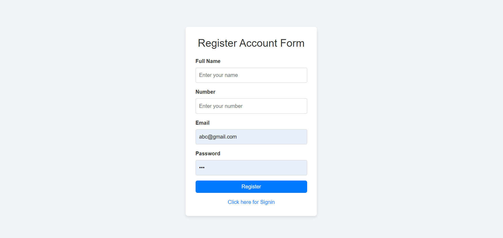
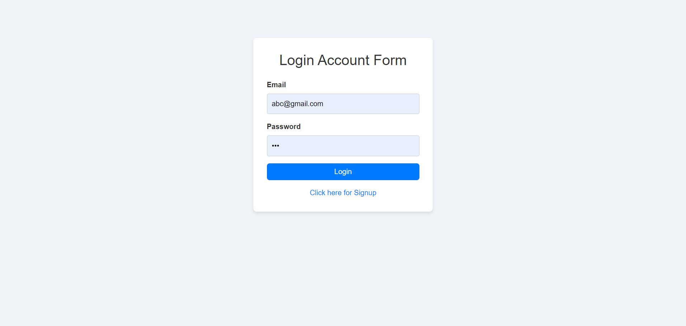
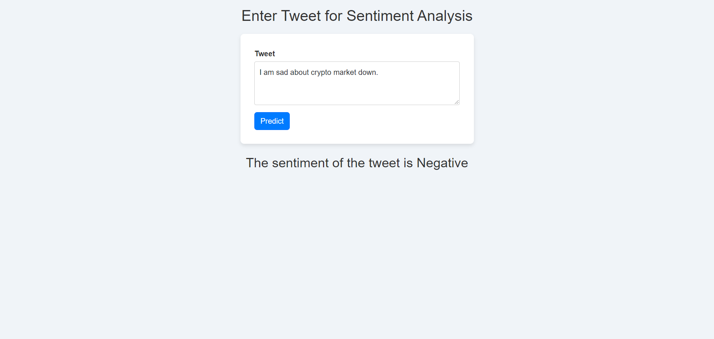

# Analyzing the Impact of Tweets on Cryptocurrency Market Trends

## Overview

This project uses sentiment analysis of tweets to predict cryptocurrency market trends. It implements a deep learning model combining LSTM and GRU to analyze tweets and provides insights into how public sentiment impacts cryptocurrency prices. 

## Features

- **User Authentication**: Users can register, log in, and access the sentiment analysis dashboard.
- **Sentiment Analysis**: Analyze the sentiment of tweets in real-time using a pre-trained LSTM-GRU model to classify the sentiment as positive, negative, or neutral.
- **Prediction Dashboard**: Once logged in, users can input tweets and receive sentiment predictions.
- **Protected Routes**: The sentiment prediction functionality is restricted to authenticated users.
- **MongoDB Integration**: User information is stored in a MongoDB database.

## Tech Stack

- **Frontend**: React, Bootstrap
- **Backend**: Flask, REST API
- **Machine Learning**: Python, TensorFlow, Keras (LSTM and GRU models), NLTK, NumPy, Pandas, pymongo
- **Database**: MongoDB
- **Tools**: Jupyter, Git & GitHub
- **Machine Learning**: TensorFlow, Keras (LSTM and GRU models), NLTK, NumPy, Pandas, pymongo
- **Database**: MongoDB
- **Model**: Pre-trained `lstm_gru_cryptocurrency_tweet_model.h5`
- **HTTP Client**: Axios

## Screenshots

### Home Page

### Register Page

### Login Page

### Prediction Page

### Frontend Components

- **`App.js`**: Main component that sets up routing for the app.
- **`Home.js`**: Landing page describing the project.
- **`Login.js`**: Page for user authentication (login).
- **`Register.js`**: Page for new user registration.
- **`Prediction.js`**: Form to input a tweet and display sentiment analysis results.
- **`PrivateRoute.js`**: Protects the prediction page, ensuring only authenticated users have access.

### Backend Files

- **`app.py`**: The main Flask app handling user registration, login, and prediction.
- **`lstm_gru_model.py`**: Script containing the LSTM-GRU sentiment analysis model.
- **`lstm_gru_cryptocurrency_tweet_model.h5`**: Pre-trained model file for sentiment prediction.

## Backend API Endpoints

| Endpoint        | Method | Description                   |
|-----------------|--------|-------------------------------|
| `/api/register` | POST   | Registers a new user           |
| `/api/login`    | POST   | Logs in an existing user       |
| `/predict`      | POST   | Receives a tweet and returns its sentiment analysis |

<<<<<<< HEAD
## Data

**`Tweets Dataset`**: Contains tweets related to cryptocurrency along with metadata such as tweet timestamp and user information. The dataset is preprocessed using NLTK to clean and tokenize the text data.

## Model Details

- The **LSTM-GRU hybrid model** processes each tweet to predict the sentiment (positive, negative, or neutral).
- The model was trained on a large dataset of cryptocurrency-related tweets using TensorFlow and Keras.
- **`lstm_gru_cryptocurrency_tweet_model.h5`** is the pre-trained model file that the backend uses for predictions.

